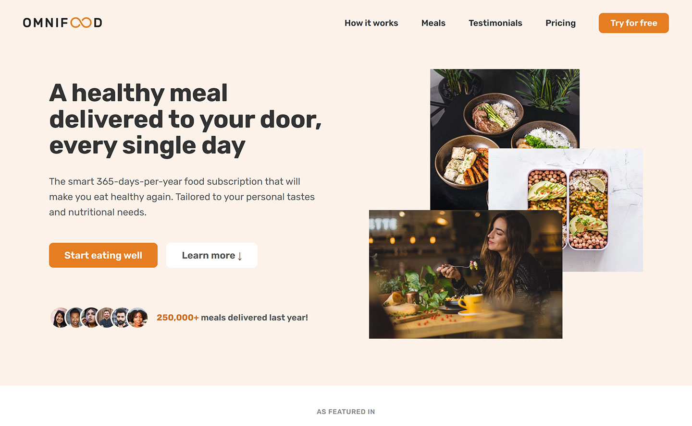

# HTML CSS Udemy final project

This project was educational and done according to the Udemy HTML CSS course.

## Table of contents

- [Screenshot](#screenshot)
- [Built with](#built-with)
- [What I learned](#what-i-learned)
- [Author](#author)

### Screenshot

### Built with

- Semantic HTML5 markup
- CSS custom properties
- CSS Grid
- Flexbox
- Desktop-first workflow
- Media queries

### What I learned

I was able to put all the things that I learned into practice. Starting with the HTML, then doing the CSS part and finally the mediaqueries.

## Author

[@CodePoku7]
